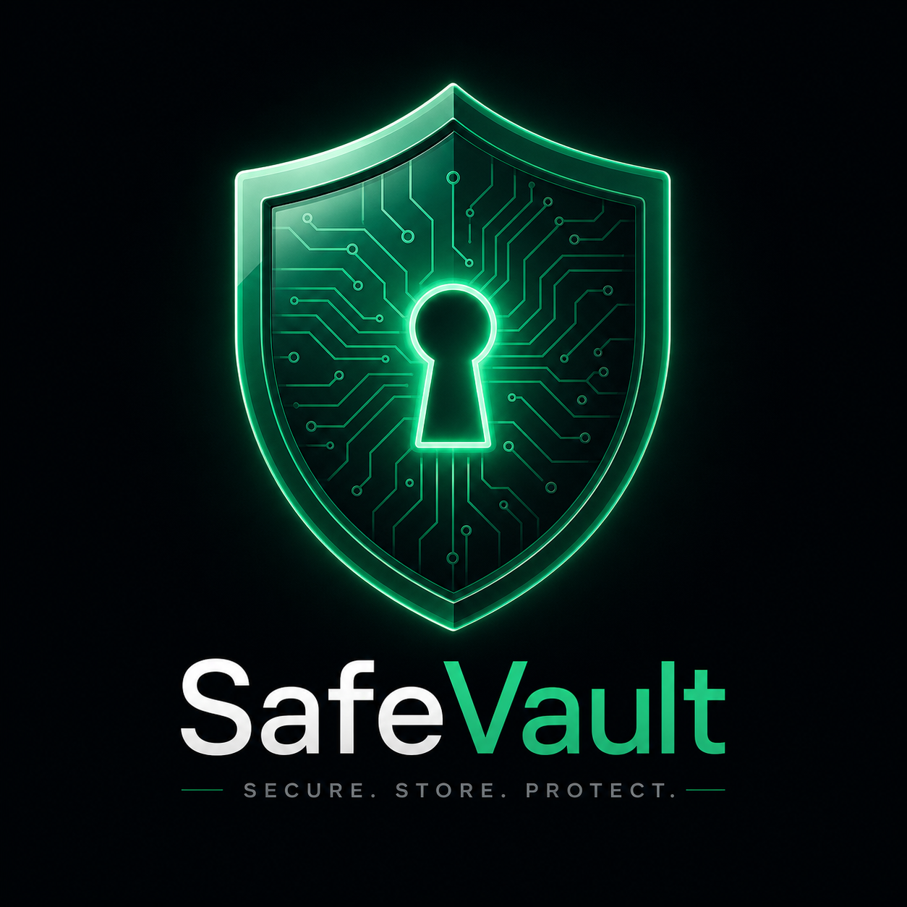
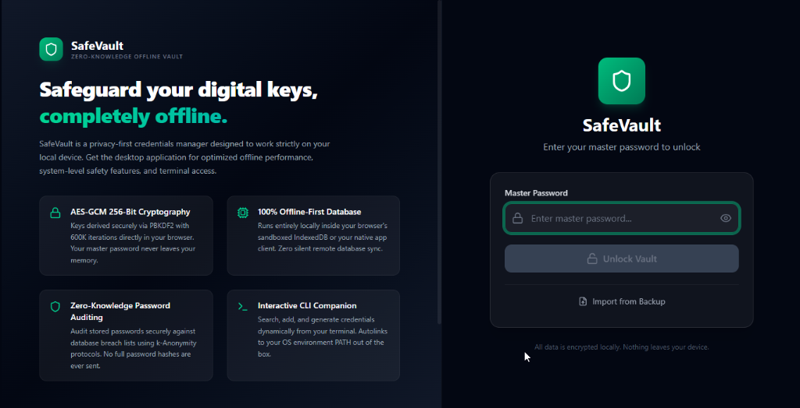
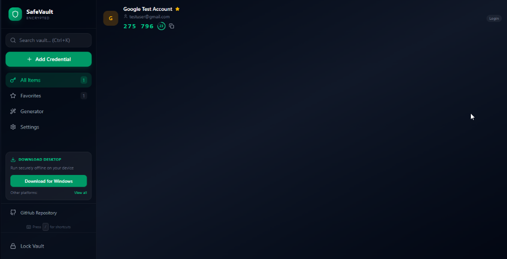
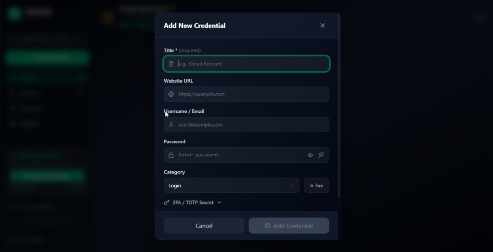
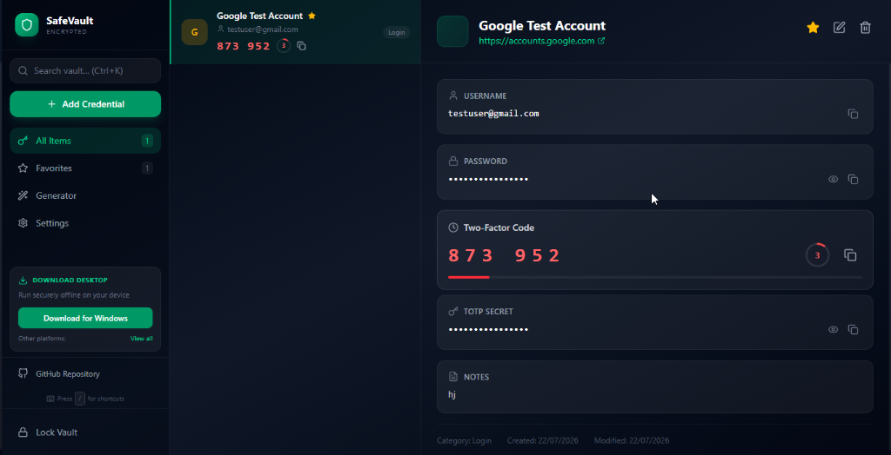
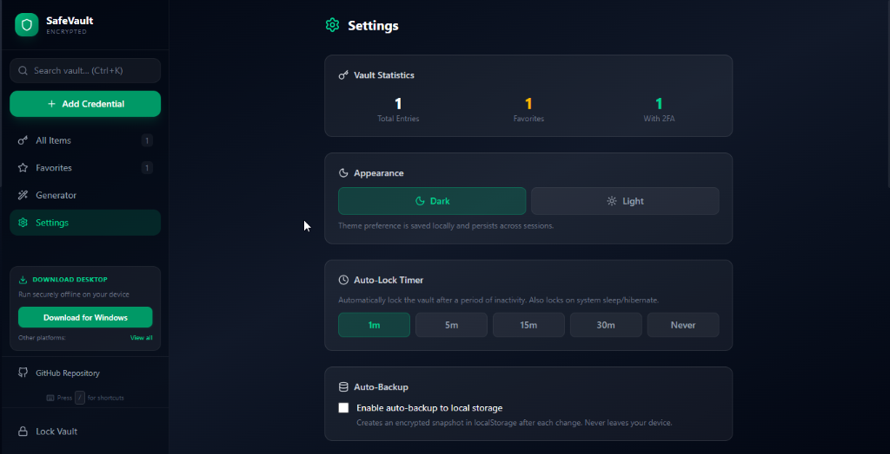
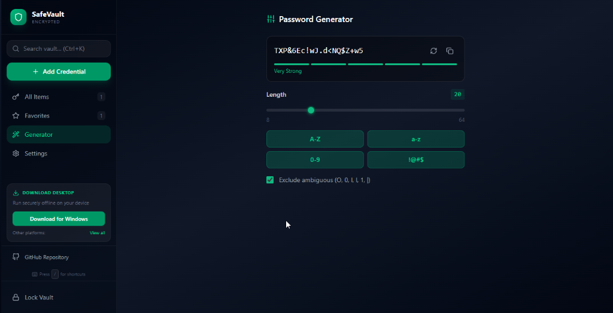

<div align="center">



# 🔐 SafeVault

### Zero-Knowledge, Offline-First Credential Manager

**Your passwords. Your device. Your control. Nothing leaves your machine.**

[](LICENSE)
[](https://github.com/SudhirDevOps1/SafeVault/actions)
[](https://www.typescriptlang.org/)
[](https://react.dev/)
[](https://www.electronjs.org/)

[Features & Roadmap](docs/features.md) • [CLI Guide](docs/cli-guide.md) • [Changelog](docs/CHANGELOG.md) • [Security](docs/SECURITY.md) • [Contributing](docs/CONTRIBUTING.md) • [Installation](#-installation--downloads)

</div>

---

## 📸 App Showcase

Here is how the SafeVault application looks when running on a web browser:

### 🔐 1. Zero-Knowledge Split Landing Screen
On standard web browsers, SafeVault displays a split showcase layout featuring direct, auto-detected OS desktop download options next to the unlock/setup forms.



---

### 📊 2. Main Dashboard & Active TOTP 2FA
The primary dashboard lists all credential cards, categorized items, search utilities, and a secure desktop download card in the sidebar.



---

### ✍️ 3. Add New Credential Form
A clean dialog allows creating logins, cards, and secure notes with optional website URL and TOTP token configurations.



---

### 🔍 4. Credential Detail & Decryption View
Provides click-to-copy fields, hidden password inspection toggles, notes, and live 2FA countdown meters.



---

### ⚙️ 5. Security Settings & Theme Toggles
Features responsive statistics panels, Light/Dark appearance triggers, inactivity auto-lock sliders, and local encrypted backup utilities.



---

### 🔑 6. Password Generator
Allows generating extremely strong cryptographically random strings with specific length and ambiguous character exclusions.



---

## ✨ Key Features

SafeVault is engineered with zero-trust principles. Below is the breakdown of our core capabilities:

### 🔒 Security Hardening
* **AES-GCM 256-Bit Cryptography:** Keys derived securely via PBKDF2 with 600K iterations directly in your browser. Your master password never leaves your memory.
* **Anti-Screen Capture / Screenshot Blocking:** Built-in protection in desktop clients to prevent local malware from grabbing vault data.
* **Transient Session Network Consent:** App starts completely offline and blocks all update checks until explicit transient permission is granted via startup banner.
* **Constant-Time Comparison:** Blocks timing attack probes.
* **Clipboard Scrubbing:** Automatically clears copied secrets after 30 seconds.

### 📱 Full Feature Set
* **TOTP 2FA Authenticator:** Real-time generation of 6-digit codes with visual countdown meters.
* **Universal CSV Importer:** Directly parse and import credentials from Bitwarden, ProtonPass, Brave, DuckDuckGo, Chrome, and 40+ other formats.
* **Security Health Audit:** Local zero-knowledge scanner checking passwords against leaked breach lists using the k-Anonymity privacy protocol.
* **Interactive CLI Companion:** Global console tool (`safevault`) featuring case-insensitive fuzzy matching and specific property flags (`-u`, `-p`, `-t`).
* **Appearance Customization:** Fully responsive light/dark styling preferences, dynamically saved and persisted.

### 🌐 Privacy & Network Control
* **100% Offline-First:** Runs entirely locally inside your browser's sandboxed storage (IndexedDB via Dexie) or your desktop client.
* **Zero Telemetry or Analytics:** No diagnostic tracking, user metrics, or background pings.
* **No Third-Party CDNs:** Fonts, icons, and libraries are locally bundled in the distribution.

---

## 🛡️ Security Architecture & Privacy Policy

> [!IMPORTANT]
> **Zero-Knowledge Principle:** All cryptographic processes occur locally. Your master password is used solely to derive your local encryption key and is never written to disk or sent across any network.

```
┌─────────────────────────────────────────────────────┐
│                    Master Password                  │
└──────────────────┬──────────────────────────────────┘
                   │ PBKDF2 (600K iterations, SHA-512)
                   ▼
┌─────────────────────────────────────────────────────┐
│              Encryption Key (256-bit)               │
└──────────────────┬──────────────────────────────────┘
                   │ AES-GCM + random IV (12 bytes)
                   ▼
┌─────────────────────────────────────────────────────┐
│        Encrypted Vault (IndexedDB, local only)      │
└─────────────────────────────────────────────────────┘
```

### 🚫 Non-Negotiable Network Rules:
* ❌ **No Telemetry/Analytics:** SafeVault never collects usage statistics or diagnostic data.
* ❌ **Zero Server Calls:** All credentials remain offline. No cloud syncing or external database calls.
* ❌ **No Third-Party CDNs:** Fonts, icons, and libraries are locally bundled in the distribution.
* ❌ **Secure audits:** Breach audits use `k-Anonymity` matching, sending only the first 5 chars of a SHA-1 hash (never full passwords/hashes).

---

## 🚀 Installation & Downloads

### Official Pre-built Binaries (v1.1.3)

Download the latest release files directly from the [GitHub Releases Page](https://github.com/SudhirDevOps1/SafeVault/releases/latest).

#### 🪟 Windows (Windows 10/11)
- **Installer (Recommended):** Download `SafeVault.Setup.1.1.3.exe`. Double-click to install. This automatically registers start menu entries, desktop shortcuts, and links the application icons.
- **Portable Version:** Download `SafeVault.1.1.3.exe`. A single standalone binary that runs instantly without installation (useful for USB drives).

#### 🍎 macOS (Apple Silicon M1/M2/M3)
- **DMG Installer:** Download `SafeVault-1.1.3-arm64.dmg`. Double-click to open, and drag **SafeVault** to your `Applications` folder.
- **ZIP Archive:** Download `SafeVault-1.1.3-arm64-mac.zip`. Unpack and run the application directly.
*Note: If macOS blocks launch with a "Developer cannot be verified" warning, right-click the app, select **Open**, and confirm.*

#### 🐧 Linux (Ubuntu, Debian, Fedora, Arch, etc.)
- **AppImage:** Download `SafeVault-1.1.3.AppImage`. Run the following command in your terminal to make it executable and launch:
  ```bash
  chmod +x SafeVault-1.1.3.AppImage
  ./SafeVault-1.1.3.AppImage
  ```

#### 🤖 Android (Mobile / Tablet)
- **APK Installer:** Download `SafeVault-v1.1.3.apk`. Install it directly on your Android phone or tablet to run SafeVault natively.

### Build from Source

```bash
# Clone the repository
git clone https://github.com/SudhirDevOps1/SafeVault.git
cd SafeVault

# Install dependencies
npm install

# Development mode (web)
npm run dev

# Build for production
npm run build

# Build Electron desktop app (requires electron deps)
npm run electron:build
```

---

## 📖 Usage

### First Launch
1. Launch SafeVault
2. Review the Privacy Policy
3. Create a strong master password (enforced: 8+ chars, mixed case, numbers, symbols)
4. Your vault is ready

### Keyboard Shortcuts

| Shortcut | Action |
|----------|--------|
| `Ctrl+Shift+L` | Lock vault (works even while typing) |
| `Ctrl+N` | New credential |
| `Ctrl+K` | Focus search |
| `Ctrl+G` | Open password generator |
| `/` | Show all shortcuts |
| `Esc` | Close modal / deselect |

### Backup & Restore
- **Export** encrypted backup: Settings → Export Encrypted Backup
- **Import** from backup: Login screen → Import from Backup
- **Auto-backup**: Enable in Settings (saves to localStorage)

---

## 🛠️ Development

### Prerequisites
- Node.js 20+
- npm 10+

### Scripts

```bash
npm run dev          # Start dev server (Vite)
npm run build        # Production build
npm run preview      # Preview production build
npm run test         # Run tests (Vitest)
npm run test:watch   # Tests in watch mode
npm run test:coverage # Coverage report
npm run lint         # Lint code
npm run typecheck    # TypeScript check
```

### Project Structure

```
SafeVault/
├── src/
│   ├── components/       # React UI components
│   ├── hooks/            # Custom hooks (auto-lock, shortcuts, etc.)
│   ├── stores/           # Zustand state management
│   ├── utils/            # Crypto, TOTP, password gen, logger, DB
│   ├── test/             # Test setup
│   ├── App.tsx           # Entry point
│   └── main.tsx          # React mount
├── electron/
│   ├── main.js           # Electron main process (hardened)
│   └── preload.js        # contextBridge secure IPC
├── public/
├── .github/              # GitHub templates & CI/CD
├── electron-builder.json # Electron build config
├── vitest.config.ts      # Test config
└── README.md
```

---

## 🧪 Testing

```bash
npm test
```

Test suites cover:
- ✅ Cryptographic functions (encryption, key derivation, constant-time compare)
- ✅ TOTP generation (RFC 6238 compliance)
- ✅ Password generator (charset selection, entropy)
- ✅ Password policy enforcement
- ✅ Secure logger (sensitive data redaction)

---

## 🤝 Contributing

We welcome contributions! Please see [CONTRIBUTING.md](CONTRIBUTING.md) for guidelines.

### Quick Start
1. Fork the repo
2. Create a feature branch: `git checkout -b feat/amazing-feature`
3. Commit changes: `git commit -m 'feat: add amazing feature'`
4. Push to branch: `git push origin feat/amazing-feature`
5. Open a Pull Request

---

## 📄 License

MIT License - See [LICENSE](LICENSE) for details.

---

## 🙏 Acknowledgments

- [React](https://react.dev/) - UI framework
- [Vite](https://vite.dev/) - Build tool
- [Tailwind CSS](https://tailwindcss.com/) - Styling
- [Zustand](https://zustand-demo.pmnd.rs/) - State management
- [Dexie](https://dexie.org/) - IndexedDB wrapper
- [Lucide](https://lucide.dev/) - Icons
- [Electron](https://www.electronjs.org/) - Desktop framework

---

## 📞 Support

- 📖 [Documentation](https://github.com/SudhirDevOps1/SafeVault/wiki)
- 🐛 [Report a bug](https://github.com/SudhirDevOps1/SafeVault/issues/new?template=bug_report.md)
- 💡 [Request a feature](https://github.com/SudhirDevOps1/SafeVault/issues/new?template=feature_request.md)
- 🔒 [Report security issue](docs/SECURITY.md)

---

<div align="center">

**Built with 🔐 by [SudhirDevOps1](https://github.com/SudhirDevOps1)**

_Your privacy is not optional. It's the default._

</div>
