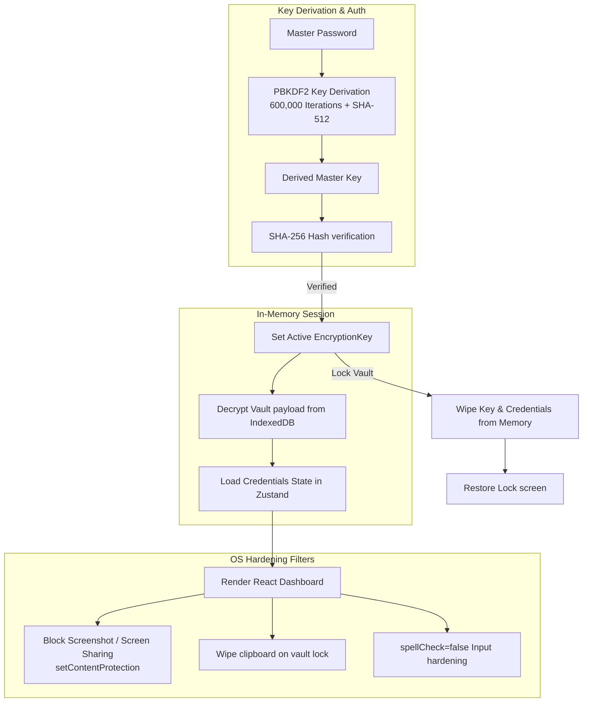
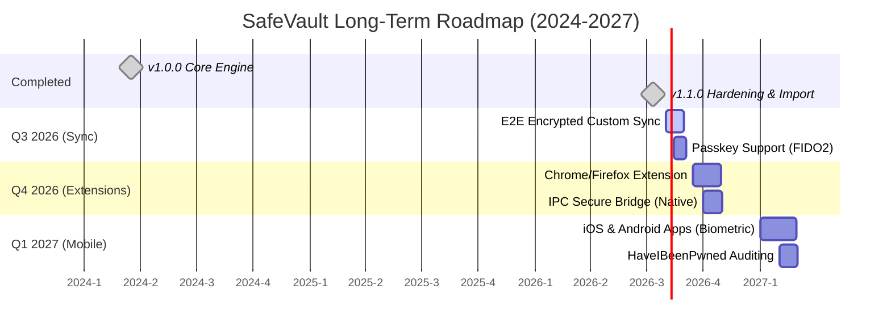

# 🌟 SafeVault Features & Advanced Roadmap

SafeVault is a premium, offline-first, zero-knowledge credential manager and authenticator. This document details the exact technical implementation of existing features, advanced security design, and a long-term releases roadmap.

---

## 🏗️ Security Architecture Flow

SafeVault operations run entirely client-side. The following diagram illustrates how keys are generated, verified, and utilized to encrypt or decrypt credentials in memory without ever writing plain keys or passwords to disk.



---

## 🚀 Feature Specifications (Current Status)

### 🔑 v1.0.0: Core Encryption & Authenticator
* **Zero-Knowledge Architecture:** The master password is never stored anywhere, nor is it ever sent over the network.
* **PBKDF2 Derivation:** Derived master key uses 600,000 iterations + SHA-512 to defend against brute-force attacks.
* **IndexedDB Local Store:** Uses Dexie.js for persistent, secure storage in the user's browser runtime.
* **RFC-6238 TOTP Engine:** Full-fledged secondary 2FA authenticator with dynamic countdown UI and Base32 checks.
* **Memory Auto-Lock:** System inactivity, sleep, and hibernate events automatically trigger vault memory wipes.

### 🛡️ v1.1.0: OS Hardening & CSV Importer
* **Universal CSV Importer:** Maps custom headers dynamically from 40+ browsers and password managers (Brave, Bitwarden, ProtonPass, Chrome, Safari, etc.).
* **Anti-Screen Capture:** Leverages Electron's native window filters (`setContentProtection(true)`) to block screen sharing/screenshots.
* **Clipboard scrubbing on lock:** Locking the vault instantly wipes the OS clipboard, protecting copied passwords from history-snooping scripts.
* **Keylogger protections:** Set `spellCheck={false}`, `autoCorrect="off"`, and `autoCapitalize="none"` on password fields to disable OS-level keyboard logs.
* **Optional Update Checks:** Privacy-first toggle in settings to query GitHub API for releases on startup (disabled by default).

---

## 💻 CLI Command-Line Utility

SafeVault features a developer-friendly command-line companion tool. The CLI uses identical local cryptographic implementations (PBKDF2 600K iterations + AES-256-GCM) and is fully compatible with desktop backups.

### CLI Features
* **Case-Insensitive Fuzzy Matching:** Searching for `github` matches entries like `GitHub Personal` or `github-work` automatically. If multiple matches are found, it lists options to help refine selection.
* **Granular Extraction Flags:** Extract specific data properties instantly without printing full entries:
  * `safevault get <title> -u` (Print only username to stdout)
  * `safevault get <title> -p` (Directly copy password to clipboard and wipe in 15 seconds)
  * `safevault get <title> -t` (Generate and print the dynamic 6-digit TOTP 2FA code)

### Commands
```bash
safevault init               # Setup and create a new offline vault
safevault add                # Securely add a new credential entry
safevault list               # View all credential titles and usernames
safevault get <title>        # Fetch details, copy password, generate active TOTP
safevault import <file.json> # Load GUI-exported backup payloads
safevault export <file.json> # Save current data as GUI-importable backup
```

---

## 📈 Long-Term Releases Roadmap

This roadmap outlines our transition from a local desktop client to a multi-device, sync-enabled, browser-integrated ecosystem.



### 🛰️ 1. v1.2.0: E2EE Sync & Passkeys (Q3 2026)
* **Zero-Knowledge Cloud Sync:** Optional WebDAV, Nextcloud, or custom server sync. Data is encrypted locally *before* syncing to ensure the server never sees the keys.
* **Peer-to-Peer Wi-Fi Sync:** Secure local database synchronization directly between devices over local networks (no cloud required).
* **FIDO2 / WebAuthn Passkeys:** Storing and unlocking credentials using hardware security tokens (e.g., YubiKeys) or system passkeys.

### 🌐 2. v1.3.0: Browser Extension Integration (Q4 2026)
* **Web Extension Packaging:** Porting SafeVault frontend as an extension for Chrome, Firefox, Edge, and Safari.
* **Native Message IPC Bridge:** Safe local IPC channel linking the browser extension to the background desktop vault.
* **Contextual Autofill:** Inline dropdown prompts on username/password login forms.

### 📱 3. v1.4.0: Mobile Apps & Advanced Auditing (Q1 2027)
* **Biometric Lock Integration:** Native iOS (TouchID/FaceID) and Android biometrics integration.
* **Offline Security Audits:** Checking stored password hashes against breach databases using k-Anonymity protocols (e.g., sending only first 5 chars of hash).
* **Emergency Access Protocols:** Cryptographic secret-sharing (Shamir's Secret Sharing) to split master credentials for emergency family recovery.

---

## 📂 Documentation Navigator
- [README.md](../README.md) - Main Page
- [CHANGELOG.md](CHANGELOG.md) - Release History
- [CONTRIBUTING.md](CONTRIBUTING.md) - How to contribute
- [SECURITY.md](SECURITY.md) - Responsible Disclosure
- [CODE_OF_CONDUCT.md](CODE_OF_CONDUCT.md) - Code of conduct
