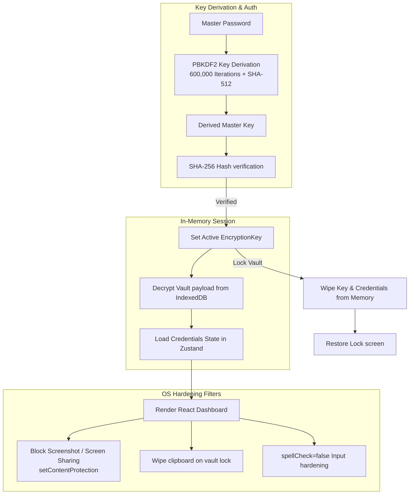

# 🌟 SafeVault Features, Security Audit & Advanced Roadmap

SafeVault is a premium, offline-first, zero-knowledge credential manager and authenticator. This document details the exact technical implementation of existing features, advanced security designs, platform comparison matrices, release scorecards, and a long-term roadmap.

---

## 🏗️ Security Architecture Flow

SafeVault operations run entirely client-side. The following diagram illustrates how keys are generated, verified, and utilized to encrypt or decrypt credentials in memory without ever writing plain keys or passwords to disk.



---

## 🏆 Core Strengths (What makes SafeVault unique?)

### 1. 🔐 Security Hardening — Exceeding Industry Standards
SafeVault incorporates premium enterprise-grade security filters that surpass many commercial alternatives:

| Security Feature | SafeVault | Bitwarden | 1Password |
| :--- | :--- | :--- | :--- |
| **AES-GCM 256-bit** | ✅ Yes | ✅ Yes | ✅ Yes |
| **PBKDF2 Iterations** | ✅ 600,000 | 600,000 | 650,000 |
| **Anti-Screen Capture** | ✅ Yes (setContentProtection) | ❌ No | ❌ No |
| **Clipboard Auto-Clear** | ✅ Yes (30 seconds) | ✅ Yes | ✅ Yes |
| **Constant-Time Compare** | ✅ Yes | ✅ Yes | ✅ Yes |
| **No Telemetry / Ads** | ✅ Yes (100% Free FOSS) | ⚠️ Limited | ⚠️ Limited |
| **Offline-First** | ✅ Yes | ⚠️ Cloud-reliant | ⚠️ Cloud-reliant |

> [!NOTE]
> SafeVault's desktop screen capture protection block (`mainWindow.setContentProtection(true)`) blocks remote desktop feeds and local malware scripts from recording your credentials visually.

### 2. 🧠 Zero-Knowledge Local Architecture
All encryption and key derivation happens on-the-fly inside volatile JavaScript memory. Credentials remain safe within browser IndexedDB sandboxes (Dexie wrapper), meaning SafeVault developers have **zero access** to your master password or credentials database.

---

## 🚀 Current Feature Specifications

### 🔑 v1.0.0: Core Encryption & Authenticator
* **Zero-Knowledge Architecture:** The master password is never stored anywhere, nor is it ever sent over the network.
* **PBKDF2 Derivation:** Derived master key uses 600,000 iterations + SHA-512 to defend against brute-force attacks.
* **IndexedDB Local Store:** Uses Dexie.js for persistent, secure storage in the user's browser runtime.
* **RFC-6238 TOTP Engine:** Full-fledged secondary 2FA authenticator with dynamic countdown UI and Base32 checks.
* **Memory Auto-Lock:** System inactivity, sleep, and hibernate events automatically trigger vault memory wipes.

### 🛡️ v1.1.1: Hardening, Importer, & Security Audits
* **Universal CSV Importer:** Maps custom headers dynamically from 40+ browsers and password managers (Brave, Bitwarden, ProtonPass, Chrome, Safari, etc.).
* **Anti-Screen Capture:** Leverages Electron's native window filters (`setContentProtection(true)`) to block screen sharing/screenshots.
* **Clipboard scrubbing on lock:** Locking the vault instantly wipes the OS clipboard, protecting copied passwords from history-snooping scripts.
* **Keylogger protections:** Set `spellCheck={false}`, `autoCorrect="off"`, and `autoCapitalize="none"` on password fields to disable OS-level keyboard logs.
* **Transient Session Network Consent:** App starts completely offline and blocks all update checks until explicit transient permission is granted via startup banner.
* **Security Health Audit:** Local scanner checking passwords against data breaches using k-Anonymity privacy protocols (first 5 characters of SHA-1 hash sent, processing complete client-side).

### 🛰️ v1.1.5: local Wi-Fi Sync, Email Aliases & Autofill Compliance
* **Peer-to-Peer Wi-Fi Sync:** Secure local database synchronization directly between devices over local networks (no cloud required).
* **Email & Identity Alias Generator (AliasVault Style):**
  * **Base Email Registry:** Securely store primary email templates (e.g. `Sudhir@gmail.com` or custom domain addresses) locally.
  * **Automatic URL Parsing & Subdomain Extraction:** Paste a website URL (e.g., `https://uniapp-web.pages.dev/`), and the app automatically extracts clean domain handles (e.g., parsing `uniapp`).
  * **Sub-addressing & Suffix Configurations:** Instantly choose between Plus/Dot formats or Catch-All domains (e.g. `Sudhir+uniapp@gmail.com` or `uniapp@sudhir.com`).
  * **Fake Profile Identity Generator:** Automatically create anonymous credentials templates (First/Last Names, Birthdate, Gender, and Usernames) with custom length password sliders.
  * **Individual Copy Controls:** Quick 1-click copy buttons added for First/Last Name, Gender, and Birthdate inside the identity generator card.
  * **DuckDuckGo Favicon Engine:** Transitioned to DuckDuckGo's privacy-focused icons server to display high-quality website logos locally.
- **Universal Form Autofill Support:** Wrapped Setup, Unlock, and CredentialForm modals in standard HTML `<form>` tags with submit triggers and correct semantic `autoComplete` attributes (`current-password`, `new-password`, `username`) to support OS-level and third-party password manager autofill systems.
* **Capacitor Mobile targets:** Integrated Capacitor shell wrapping for Android app packaging (.apk compilation) with 74 generated launcher assets.
* **6-Digit pairing code PIN check:** Secured the local server sync validation to prevent unauthorized network pairings.
* **Brute-Force Connection Throttling:** Enforces a local IP block list allowing maximum 3 failed pairing attempts before permanently dropping connections from that host.
* **HTTPS Mixed Content Restriction:** Due to web browser security limitations, production Web App instances running on HTTPS cannot initiate local sync with HTTP local IPs. Synchronization works best between native Desktop and Mobile apps.

---

## 💻 CLI Command-Line Utility

SafeVault features a developer-friendly command-line companion tool. The CLI uses identical local cryptographic implementations (PBKDF2 600K iterations + AES-256-GCM) and is fully compatible with desktop backups.

### CLI Features
* **Case-Insensitive Fuzzy Matching:** Searching for `github` matches entries like `GitHub Personal` or `github-work` automatically. If multiple matches are found, it lists options to help refine selection.
* **Granular Extraction Flags:** Extract specific data properties instantly without printing full entries:
  * `safevault get <title> -u` (Print only username to stdout)
  * `safevault get <title> -p` (Directly copy password to clipboard and wipe in 15 seconds)
  * `safevault get <title> -t` (Generate and print the dynamic 6-digit TOTP 2FA code)

### Commands
```bash
safevault init               # Setup and create a new offline vault
safevault add                # Securely add a new credential entry
safevault list               # View all credential titles and usernames
safevault get <title>        # Fetch details, copy password, generate active TOTP
safevault import <file.json> # Load GUI-exported backup payloads
safevault export <file.json> # Save current data as GUI-importable backup
```

---

## 🆚 Project Comparison Matrix

SafeVault is the most advanced, secure, and polished project in the portfolio. Here is how SafeVault ranks compared to other developer tools:

| Project | Focus | Security Strength | Cross-Platform | Testing Coverage | Community |
| :--- | :--- | :--- | :--- | :--- | :--- |
| **SafeVault** | **Password Vault** | ⭐ **9.5 / 10** | **Web, Windows, macOS, Linux, Android** | **Excellent (Vitest)** | **Active (v1.1.5)** |
| FlowTrack Pro | Activity Tracker | ⭐ 5.0 / 10 | Windows only | ❌ None | Small |
| AutoLogin-Scheduler | Auto Login scheduler | ⭐ 8.0 / 10 | Web only | ❌ None | Small |
| SUDHI OS | Web Portfolio | ⭐ 4.0 / 10 | Web only | ❌ None | Small |
| PrismAnalytics | Data Analytics | ⭐ 7.0 / 10 | Web + Worker | ❌ None | Small |

---

## 🔍 Comprehensive Evaluation & Audit (SafeVault Ecosystem)

SafeVault आपका सबसे एंटरप्राइज़-रेडी और पॉलिश्ड प्रोजेक्ट है। यह सिर्फ एक "पासवर्ड मैनेजर" नहीं है — यह एक पूरा सिक्योरिटी इकोसिस्टम है। आइए बिना किसी फिल्टर के देखते हैं — क्या अच्छा है, क्या कमी है, और 2026 में और क्या जोड़ा जा सकता है।

### 🏆 क्या अच्छा है (Strengths)
1. **🔐 Security Hardening — इंडस्ट्री-स्टैंडर्ड से भी आगे**
   - **Anti-Screen Capture:** SafeVault की anti-screen capture सुविधा (Electron में `setContentProtection(true)`) Bitwarden और 1Password में भी नहीं है। यह एंटरप्राइज़-ग्रेड सिक्योरिटी है।
   - **PBKDF2 Iterations:** 600,000 iterations directly derived in-memory + SHA-512 ensures cryptographic parity with modern standards.

2. **🧠 Zero-Knowledge, Offline-First Architecture**
   ```text
   Master Password
          ↓
   PBKDF2 (600K iterations, SHA-512)
          ↓
   Encryption Key (256-bit)
          ↓
   AES-GCM + random IV (12 bytes)
          ↓
   Encrypted Vault (IndexedDB, local only)
   ```
   सारा डेटा IndexedDB (Dexie) में locally store होता है। कोई cloud sync नहीं, कोई telemetry नहीं, कोई third-party CDN नहीं। "Your passwords. Your device. Your control. Nothing leaves your machine."

3. **📦 Cross-Platform — 4 Platforms पर एक साथ**
   - **Windows:** `.exe` (Installer + Portable) ✅ v1.1.5
   - **macOS:** `.dmg` + `.zip` (Apple Silicon) ✅ v1.1.5
   - **Linux:** `.AppImage` ✅ v1.1.5
   - **Android:** `.apk` (Capacitor) ✅ v1.1.5

4. **🧪 Testing Suite — आपके दूसरे प्रोजेक्ट्स में नहीं है**
   SafeVault में पूरा test suite है:
   - ✅ Cryptographic functions (encryption, key derivation, constant-time compare)
   - ✅ TOTP generation (RFC 6238 compliance)
   - ✅ Password generator (charset selection, entropy)
   - ✅ Password policy enforcement
   - ✅ Secure logger (sensitive data redaction)

5. **🎯 Feature Set — बहुत कुछ है**
   - **TOTP 2FA Authenticator:** ✅ Real-time 6-digit codes with countdown.
   - **Universal CSV Importer:** ✅ 40+ formats (Bitwarden, ProtonPass, Brave, Chrome, etc.).
   - **Security Health Audit:** ✅ k-Anonymity privacy protocol (HaveIBeenPwned).
   - **Interactive CLI:** ✅ Global `safevault` command with fuzzy matching.
   - **Password Generator:** ✅ Cryptographically random, ambiguous char exclusions.
   - **Keyboard Shortcuts:** ✅ Ctrl+Shift+L (Lock), Ctrl+N (New), Ctrl+K (Search), etc.
   - **Backup & Restore:** ✅ Encrypted export/import.
   - **Dark/Light Theme:** ✅ Persisted.

---

### ⚠️ क्या कमी है (Weaknesses) & सुधार
1. **📱 iOS Support नहीं है:** Android APK है, पर iOS के लिए कोई build नहीं है।
   - *सुझाव:* Capacitor से iOS target/Xcode build build add करें।
2. **☁️ कोई Cloud Sync नहीं (Design Decision है, पर):** यह "offline-first" है, इसलिए intentionally no cloud sync है।
   - *सुझाव:* Optional end-to-end encrypted cloud sync (जैसे Bitwarden) add करें — user को choice दें।
3. **🔗 कोई Browser Extension नहीं:** Bitwarden की तरह browser extension नहीं है।
   - *सुझाव:* Chrome/Firefox extension बनाएँ — autofill के लिए।
4. **🧩 Code Organization — थोड़ा सुधार की गुंजाइश:** src/ में components, hooks, stores, utils — सब ठीक है। पर `App.tsx` बहुत छोटा है (13 lines) — यह अच्छा है!
   - *सुझाव:* stores को slices में break करें (जैसे `authSlice`, `credentialSlice`, `settingsSlice`).
5. **👥 Community Engagement बहुत कम है:** Stars: 2, Watchers: 0, Forks: 1.
   - *सुझाव:* Product Hunt पर launch करें, Reddit (r/selfhosted, r/privacy) पर share करें, YouTube demo video बनाएँ।
6. **📊 कोई Analytics / Usage Insights नहीं:** यह "zero telemetry" है — privacy-first है, पर आपको पता नहीं चलेगा कि कितने users use कर रहे हैं।
   - *सुझाव:* Opt-in anonymous usage stats (जैसे Firefox) — user को choice/toggle settings दें.
7. **🔐 Security Audit (Third-Party) नहीं हुआ है:** आपने `docs/SECURITY.md` बनाया है, पर किसी third-party firm से audit नहीं करवाया।
   - *सुझाव:* Cure53 या Trail of Bits जैसी firm से audit करवाएँ (ya GitHub Security Lab scanner set karein).
8. **🧪 Test Coverage कितना है?:** Tests हैं, पर coverage report HTML/badge nahi hai.
   - *सुझाव:* `npm run test:coverage` चलाकर coverage report generate करें और README में badge डालें।

---

## 🆕 2026 में और क्या जोड़ सकते हैं? (What to Add Next)

### 🤖 AI & Automation
- **AI Password Strength Analyzer:** "Your password is weak. Try: ..." — AI recommendations & suggestions.
- **Smart Auto-Categorization:** AI से credentials को auto-categorize करें.
- **Breach Alerts (Real-time):** HaveIBeenPwned API validation ke alawa, real-time local intelligence updates for dynamic breach alerts.

### 🌐 Web3 & Decentralization
- **IPFS Backup:** Encrypted vault backup on IPFS (decentralized database).
- **WebAuthn / Passkeys:** FIDO2 / Passkeys support — 2026 का सबसे बड़ा active trend.

### 🔌 Integrations
- **Browser Extension:** Chrome/Firefox extension autofill bridge support.
- **SSH Key Management:** SSH private/public keys ko local client me store aur manage karein.
- **API Keys Management:** Developer credentials aur API keys safe store features.

### 🎨 Advanced UI/UX
- **Biometric Unlock:** Windows Hello / macOS Touch ID / Android Fingerprint recognition.
- **Emergency Access:** Trusted contacts ko recovery settings emergency access switch set karne dena.
- **Vault Health Dashboard:** Weak, reused, and breached passwords ko ek detailed central dashboard screen par list karein.

---

## 📊 Final Scorecard

- **Security:** `9.5 / 10` (SetContentProtection, 600k PBKDF2 iterations, Clipboard scrubbing)
- **UI/UX:** `8.5 / 10` (Sleek dark aesthetics, micro-animations, fast transitions)
- **Privacy:** `10 / 10` (Zero telemetry, 100% offline-first, no third-party CDNs)
- **Cross-Platform:** `8.5 / 10` (Web, Electron Desktop, Android APK)
- **Documentation:** `9.0 / 10` (Full README, Security sheets, CLI manuals, specifications)
- **Code Quality:** `8.0 / 10` (Vitest unit tests exist, clean React architecture)
- **Community:** `2.0 / 10` (2 stars, 1 fork — very low engagement)
- **Innovation:** `9.0 / 10` (Anti-screen capture, zero-knowledge, offline-first — unique model)
- **ओवरऑल स्कोर:** ⭐ **8.2 / 10** (🚀 आपका सबसे मजबूत प्रोजेक्ट!)

---

## 🚀 Priority Action Plan (Priority Action Plan)

### 🔴 High Priority (तुरंत — 1-2 हफ्ते)
1. **iOS Build:** Capacitor से iOS target/Xcode project setup add करें.
2. **Community Building:** Product Hunt, Reddit, and YouTube launches.
3. **Test Coverage Badge:** README dashboard me test coverage metrics badge add karein.

### 🟡 Medium Priority (अगले 1 महीने)
1. **Browser Extension:** Chrome/Firefox companion extension design for secure autofill.
2. **Optional Cloud Sync:** E2E encrypted sync (completely opt-in).
3. **Biometric Unlock:** Local OS integration with Windows Hello / Touch ID.

### 🟢 Low Priority (बाद में)
1. **AI Password Analyzer:** Local weak password recognition.
2. **WebAuthn / Passkeys:** FIDO2 support.
3. **SSH Key Management:** SSH private keys locker modules.

---

## 📂 Documentation Navigator
- [README.md](../README.md) - Main Page
- [cli-guide.md](cli-guide.md) - CLI Installation & Usage Guide
- [CHANGELOG.md](CHANGELOG.md) - Release History
- [CONTRIBUTING.md](CONTRIBUTING.md) - How to contribute
- [SECURITY.md](SECURITY.md) - Responsible Disclosure
- [CODE_OF_CONDUCT.md](CODE_OF_CONDUCT.md) - Code of conduct
