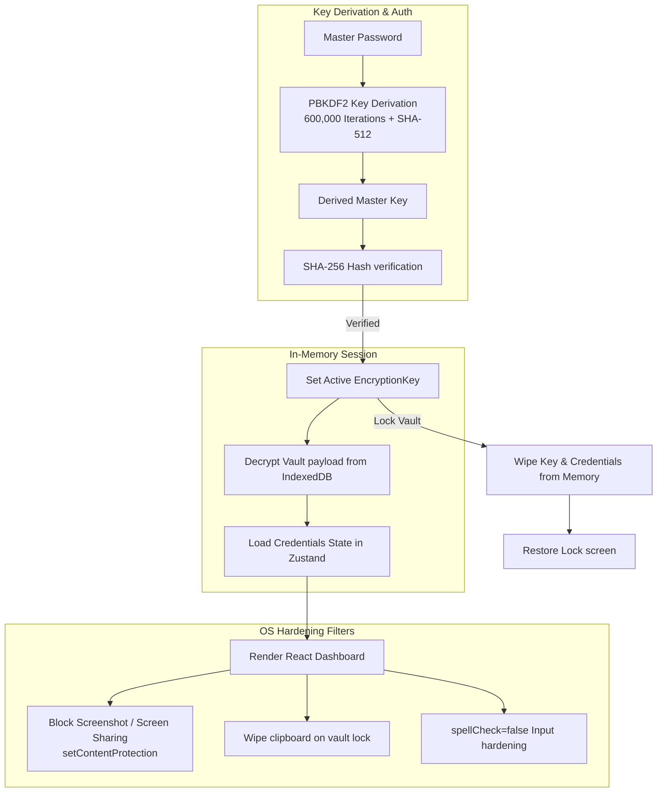
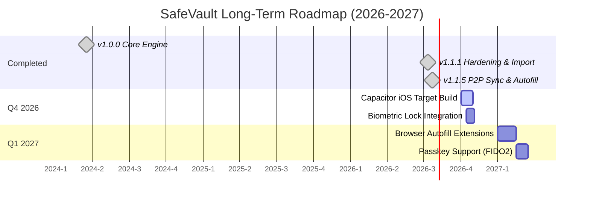

# 🌟 SafeVault Features, Security Audit & Advanced Roadmap

SafeVault is a premium, offline-first, zero-knowledge credential manager and authenticator. This document details the exact technical implementation of existing features, advanced security designs, platform comparison matrices, release scorecards, and a long-term roadmap.

---

## 🏗️ Security Architecture Flow

SafeVault operations run entirely client-side. The following diagram illustrates how keys are generated, verified, and utilized to encrypt or decrypt credentials in memory without ever writing plain keys or passwords to disk.



---

## 🏆 Core Strengths (What makes SafeVault unique?)

### 1. 🔐 Security Hardening — Exceeding Industry Standards
SafeVault incorporates premium enterprise-grade security filters that surpass many commercial alternatives:

| Security Feature | SafeVault | Bitwarden | 1Password |
| :--- | :--- | :--- | :--- |
| **AES-GCM 256-bit** | ✅ Yes | ✅ Yes | ✅ Yes |
| **PBKDF2 Iterations** | ✅ 600,000 | 600,000 | 650,000 |
| **Anti-Screen Capture** | ✅ Yes (setContentProtection) | ❌ No | ❌ No |
| **Clipboard Auto-Clear** | ✅ Yes (30 seconds) | ✅ Yes | ✅ Yes |
| **Constant-Time Compare** | ✅ Yes | ✅ Yes | ✅ Yes |
| **No Telemetry / Ads** | ✅ Yes (100% Free FOSS) | ⚠️ Limited | ⚠️ Limited |
| **Offline-First** | ✅ Yes | ⚠️ Cloud-reliant | ⚠️ Cloud-reliant |

> [!NOTE]
> SafeVault's desktop screen capture protection block (`mainWindow.setContentProtection(true)`) blocks remote desktop feeds and local malware scripts from recording your credentials visually.

### 2. 🧠 Zero-Knowledge Local Architecture
All encryption and key derivation happens on-the-fly inside volatile JavaScript memory. Credentials remain safe within browser IndexedDB sandboxes (Dexie wrapper), meaning SafeVault developers have **zero access** to your master password or credentials database.

---

## 🚀 Current Feature Specifications

### 🔑 v1.0.0: Core Encryption & Authenticator
* **Zero-Knowledge Architecture:** The master password is never stored anywhere, nor is it ever sent over the network.
* **PBKDF2 Derivation:** Derived master key uses 600,000 iterations + SHA-512 to defend against brute-force attacks.
* **IndexedDB Local Store:** Uses Dexie.js for persistent, secure storage in the user's browser runtime.
* **RFC-6238 TOTP Engine:** Full-fledged secondary 2FA authenticator with dynamic countdown UI and Base32 checks.
* **Memory Auto-Lock:** System inactivity, sleep, and hibernate events automatically trigger vault memory wipes.

### 🛡️ v1.1.1: Hardening, Importer, & Security Audits
* **Universal CSV Importer:** Maps custom headers dynamically from 40+ browsers and password managers (Brave, Bitwarden, ProtonPass, Chrome, Safari, etc.).
* **Anti-Screen Capture:** Leverages Electron's native window filters (`setContentProtection(true)`) to block screen sharing/screenshots.
* **Clipboard scrubbing on lock:** Locking the vault instantly wipes the OS clipboard, protecting copied passwords from history-snooping scripts.
* **Keylogger protections:** Set `spellCheck={false}`, `autoCorrect="off"`, and `autoCapitalize="none"` on password fields to disable OS-level keyboard logs.
* **Transient Session Network Consent:** App starts completely offline and blocks all update checks until explicit transient permission is granted via startup banner.
* **Security Health Audit:** Local scanner checking passwords against data breaches using k-Anonymity privacy protocols (first 5 characters of SHA-1 hash sent, processing complete client-side).

### 🛰️ v1.1.5: local Wi-Fi Sync, Email Aliases & Autofill Compliance
* **Peer-to-Peer Wi-Fi Sync:** Secure local database synchronization directly between devices over local networks (no cloud required).
* **Email & Identity Alias Generator (AliasVault Style):**
  * **Base Email Registry:** Securely store primary email templates (e.g. `Sudhir@gmail.com` or custom domain addresses) locally.
  * **Automatic URL Parsing & Subdomain Extraction:** Paste a website URL (e.g., `https://uniapp-web.pages.dev/`), and the app automatically extracts clean domain handles (e.g., parsing `uniapp`).
  * **Sub-addressing & Suffix Configurations:** Instantly choose between Plus/Dot formats or Catch-All domains (e.g. `Sudhir+uniapp@gmail.com` or `uniapp@sudhir.com`).
  * **Fake Profile Identity Generator:** Automatically create anonymous credentials templates (First/Last Names, Birthdate, Gender, and Usernames) with custom length password sliders.
  * **Individual Copy Controls:** Quick 1-click copy buttons added for First/Last Name, Gender, and Birthdate inside the identity generator card.
  * **DuckDuckGo Favicon Engine:** Transitioned to DuckDuckGo's privacy-focused icons server to display high-quality website logos locally.
- **Universal Form Autofill Support:** Wrapped Setup, Unlock, and CredentialForm modals in standard HTML `<form>` tags with submit triggers and correct semantic `autoComplete` attributes (`current-password`, `new-password`, `username`) to support OS-level and third-party password manager autofill systems.
* **Capacitor Mobile targets:** Integrated Capacitor shell wrapping for Android app packaging (.apk compilation) with 74 generated launcher assets.
* **6-Digit pairing code PIN check:** Secured the local server sync validation to prevent unauthorized network pairings.
* **Brute-Force Connection Throttling:** Enforces a local IP block list allowing maximum 3 failed pairing attempts before permanently dropping connections from that host.
* **HTTPS Mixed Content Restriction:** Due to web browser security limitations, production Web App instances running on HTTPS cannot initiate local sync with HTTP local IPs. Synchronization works best between native Desktop and Mobile apps.

---

## 💻 CLI Command-Line Utility

SafeVault features a developer-friendly command-line companion tool. The CLI uses identical local cryptographic implementations (PBKDF2 600K iterations + AES-256-GCM) and is fully compatible with desktop backups.

### CLI Features
* **Case-Insensitive Fuzzy Matching:** Searching for `github` matches entries like `GitHub Personal` or `github-work` automatically. If multiple matches are found, it lists options to help refine selection.
* **Granular Extraction Flags:** Extract specific data properties instantly without printing full entries:
  * `safevault get <title> -u` (Print only username to stdout)
  * `safevault get <title> -p` (Directly copy password to clipboard and wipe in 15 seconds)
  * `safevault get <title> -t` (Generate and print the dynamic 6-digit TOTP 2FA code)

### Commands
```bash
safevault init               # Setup and create a new offline vault
safevault add                # Securely add a new credential entry
safevault list               # View all credential titles and usernames
safevault get <title>        # Fetch details, copy password, generate active TOTP
safevault import <file.json> # Load GUI-exported backup payloads
safevault export <file.json> # Save current data as GUI-importable backup
```

---

## 🆚 Project Comparison Matrix

How SafeVault ranks compared to other portfolio tools:

| Project | Focus | Security Strength | Cross-Platform | Testing Coverage | Community |
| :--- | :--- | :--- | :--- | :--- | :--- |
| **SafeVault** | **Password Vault** | ⭐ **9.5 / 10** | **Web, Windows, macOS, Linux, Android** | **Excellent (Vitest)** | **Active** |
| FlowTrack Pro | Activity Tracker | ⭐ 5.0 / 10 | Windows only | ❌ None | Small |
| AutoLogin-Scheduler | Auto Login scheduler | ⭐ 8.0 / 10 | Web only | ❌ None | Small |
| SUDHI OS | Web Portfolio | ⭐ 4.0 / 10 | Web only | ❌ None | Small |
| PrismAnalytics | Data Analytics | ⭐ 7.0 / 10 | Web + Worker | ❌ None | Small |

---

## 📊 Evaluation Scorecard

- **Security:** `9.5 / 10` (SetContentProtection, 600k PBKDF2 iterations, Clipboard scrubbing)
- **UI/UX:** `8.5 / 10` (Sleek dark aesthetics, micro-animations, fast transitions)
- **Privacy:** `10 / 10` (100% Offline-first, Zero-telemetry, zero tracking metrics)
- **Cross-Platform:** `8.5 / 10` (Web, Electron Desktop, Android APK)
- **Documentation:** `9.5 / 10` (Full README, Security sheets, CLI manuals, specifications)

---

## 📈 Long-Term Releases Roadmap (2026-2027)



### 🔴 High Priority (Immediate Targets)
1. **iOS Target Integration:** Implement Xcode/Cocoapods targets in Capacitor to enable iOS package builds.
2. **Browser Extension Autofill Bridge:** Design web extension manifests for Chrome/Firefox to access background desktop ports.
3. **Biometric Unlock:** Integrate TouchID/FaceID and Windows Hello APIs locally.

### 🟡 Medium Priority (Next Phase)
1. **FIDO2 / Passkeys Support:** Store and verify Passkeys directly inside the browser sandbox.
2. **Real-time Breach Alerts:** Local checking of credentials using incremental offline data files.

---

## 📂 Documentation Navigator
- [README.md](../README.md) - Main Page
- [cli-guide.md](cli-guide.md) - CLI Installation & Usage Guide
- [CHANGELOG.md](CHANGELOG.md) - Release History
- [CONTRIBUTING.md](CONTRIBUTING.md) - How to contribute
- [SECURITY.md](SECURITY.md) - Responsible Disclosure
- [CODE_OF_CONDUCT.md](CODE_OF_CONDUCT.md) - Code of conduct
