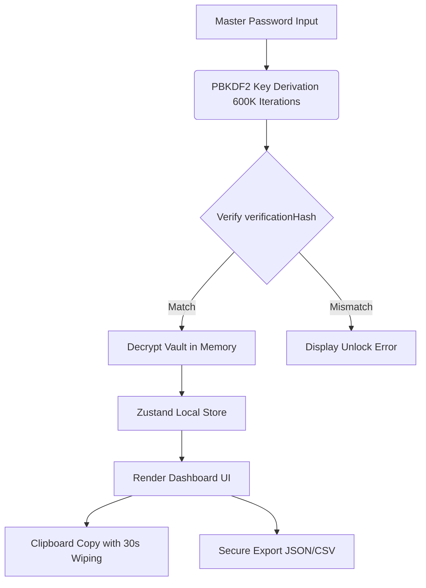
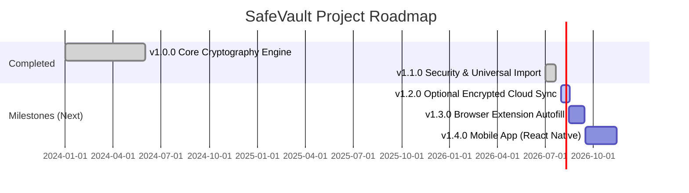

# 🌟 SafeVault features & Roadmap

SafeVault is a premium, offline-first, zero-knowledge credential manager and authenticator. This document provides a visual mapping of the system features, architecture, and the project roadmap.

---

## 🗺️ Architectural Flow

Below is a visual flowchart of how data is securely processed in SafeVault completely offline.

---

## 🚀 feature Map

### 1. 🛡️ Hardened Security
* **256-bit AES-GCM Encryption:** Hardware-accelerated local encryption.
* **Anti-Screen Capture:** Desktop window blocks screenshots and screen recording.
* **Clipboard Scrubbing:** Wipes copied data immediately on vault lock.
* **OS-Level Caching Mitigation:** Disables dictionary auto-correct logging on password inputs.

### 2. 🔌 Dynamic Importer & Exporter
* **Universal CSV Importer:** Maps CSV headers from Bitwarden, ProtonPass, Brave, DuckDuckGo, Chrome, Safari, etc.
* **Encrypted Backups:** Export/import using zero-knowledge encrypted JSON files.

### 3. 🎨 Complete Light & Dark Themes
* Dynamic CSS properties mapping that fully changes layouts on theme toggling.

---

## 📈 Release Roadmap

This timeline tracks the features completed in current releases and sets milestones for future development.

---

## 📂 Documentation Navigator
- [README.md](../README.md) - Main Page
- [CHANGELOG.md](CHANGELOG.md) - Release History
- [CONTRIBUTING.md](CONTRIBUTING.md) - How to contribute
- [SECURITY.md](SECURITY.md) - Responsible Disclosure
- [CODE_OF_CONDUCT.md](CODE_OF_CONDUCT.md) - Code of conduct
