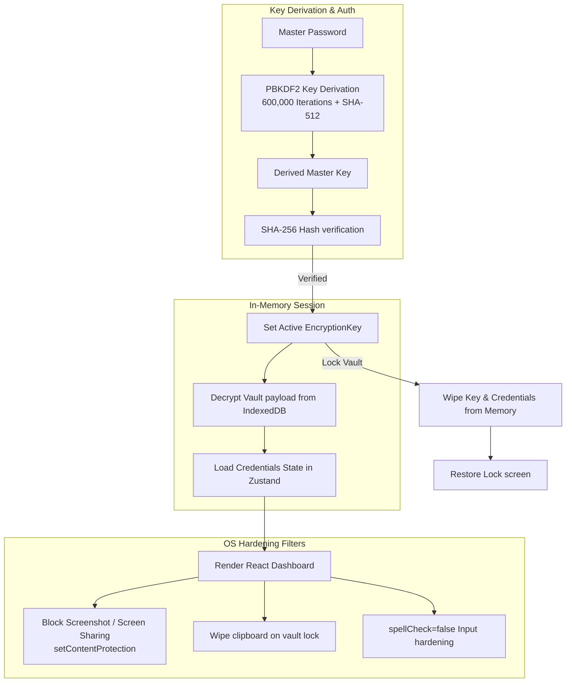
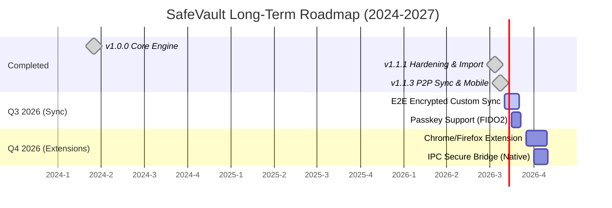

# 🌟 SafeVault Features & Advanced Roadmap

SafeVault is a premium, offline-first, zero-knowledge credential manager and authenticator. This document details the exact technical implementation of existing features, advanced security design, and a long-term releases roadmap.

---

## 🏗️ Security Architecture Flow

SafeVault operations run entirely client-side. The following diagram illustrates how keys are generated, verified, and utilized to encrypt or decrypt credentials in memory without ever writing plain keys or passwords to disk.



---

## 🚀 Feature Specifications (Current Status)

### 🔑 v1.0.0: Core Encryption & Authenticator
* **Zero-Knowledge Architecture:** The master password is never stored anywhere, nor is it ever sent over the network.
* **PBKDF2 Derivation:** Derived master key uses 600,000 iterations + SHA-512 to defend against brute-force attacks.
* **IndexedDB Local Store:** Uses Dexie.js for persistent, secure storage in the user's browser runtime.
* **RFC-6238 TOTP Engine:** Full-fledged secondary 2FA authenticator with dynamic countdown UI and Base32 checks.
* **Memory Auto-Lock:** System inactivity, sleep, and hibernate events automatically trigger vault memory wipes.

### 🛡️ v1.1.1: Hardening, Importer, & Security Audits
* **Universal CSV Importer:** Maps custom headers dynamically from 40+ browsers and password managers (Brave, Bitwarden, ProtonPass, Chrome, Safari, etc.).
* **Anti-Screen Capture:** Leverages Electron's native window filters (`setContentProtection(true)`) to block screen sharing/screenshots.
* **Clipboard scrubbing on lock:** Locking the vault instantly wipes the OS clipboard, protecting copied passwords from history-snooping scripts.
* **Keylogger protections:** Set `spellCheck={false}`, `autoCorrect="off"`, and `autoCapitalize="none"` on password fields to disable OS-level keyboard logs.
* **Transient Session Network Consent:** In compliance with strict 2026 privacy models, no network requests start automatically on app launch. The application prompts the user for network permission on startup. Permission is memory-only (transient) and resets on app relaunch.
* **Security Health Audit:** Local scanner checking passwords against data breaches using k-Anonymity privacy protocols (first 5 characters of SHA-1 hash sent, processing complete client-side).
### 🛰️ v1.1.3: Capacitor Mobile Target & Local Wi-Fi Synchronization
* **Capacitor Mobile Integration:** SafeVault now targets native mobile platforms, supporting Android packaging (.apk outputs) from the unified React codebase.
* **Local Wi-Fi Peer-to-Peer Sync:** Encrypted credentials sync directly between web, desktop, and mobile clients on the same Wi-Fi using native Node.js HTTP servers (Electron) and HTTP clients (Capacitor/Web).
* **6-Digit Verification PIN Security:** Transmissions are locked behind a screen-displayed 6-digit PIN. The payload is double-encrypted in transit with a session key derived from the PIN to block local Wi-Fi eavesdropping.
* **Vite & Gradle CI Pipelines:** Added automated Android APK compiling jobs in GitHub Action CI workflows.

---

## 💻 CLI Command-Line Utility

SafeVault features a developer-friendly command-line companion tool. The CLI uses identical local cryptographic implementations (PBKDF2 600K iterations + AES-256-GCM) and is fully compatible with desktop backups.

### CLI Features
* **Case-Insensitive Fuzzy Matching:** Searching for `github` matches entries like `GitHub Personal` or `github-work` automatically. If multiple matches are found, it lists options to help refine selection.
* **Granular Extraction Flags:** Extract specific data properties instantly without printing full entries:
  * `safevault get <title> -u` (Print only username to stdout)
  * `safevault get <title> -p` (Directly copy password to clipboard and wipe in 15 seconds)
  * `safevault get <title> -t` (Generate and print the dynamic 6-digit TOTP 2FA code)

### Commands
```bash
safevault init               # Setup and create a new offline vault
safevault add                # Securely add a new credential entry
safevault list               # View all credential titles and usernames
safevault get <title>        # Fetch details, copy password, generate active TOTP
safevault import <file.json> # Load GUI-exported backup payloads
safevault export <file.json> # Save current data as GUI-importable backup
```

---

## 📈 Long-Term Releases Roadmap

This roadmap outlines our transition from a local desktop client to a multi-device, sync-enabled, browser-integrated ecosystem.



### 🛰️ 1. v1.1.5: local Wi-Fi Sync, Email Aliases & Capacitor Targets (Released)
* **Peer-to-Peer Wi-Fi Sync:** Secure local database synchronization directly between devices over local networks (no cloud required).
* **Email & Identity Alias Generator (AliasVault Style):**
  * **Base Email Registry:** Securely store primary email templates (e.g. `Sudhir@gmail.com` or custom domain addresses) locally.
  * **Automatic URL Parsing & Subdomain Extraction:** Paste a website URL (e.g., `https://uniapp-web.pages.dev/`), and the app automatically extracts clean domain handles (e.g., parsing `uniapp`).
  * **Sub-addressing & Suffix Configurations:** Instantly choose between Plus/Dot formats or Catch-All domains (e.g. `Sudhir+uniapp@gmail.com` or `uniapp@sudhir.com`).
  * **Fake Profile Identity Generator:** Automatically create anonymous credentials templates (First/Last Names, Birthdate, Gender, and Usernames) with custom length password sliders.
  * **Direct Vault Integration:** Automatically saves generated alias card into the vault with dynamic category badges ('Alias') and comprehensive notes storage.
  * **Active Aliases Live Tracker:** Displays all currently saved email aliases in a live dashboard table with 1-click Copy actions.
* **Capacitor Mobile targets:** Integrated Capacitor shell wrapping for Android app packaging (.apk compilation) with 74 generated launcher assets.
* **6-Digit pairing code PIN check:** Secured the local server sync validation to prevent unauthorized network pairings.
* **Brute-Force Connection Throttling:** Enforces a local IP block list allowing maximum 3 failed pairing attempts before permanently dropping connections from that host.
* **HTTPS Mixed Content Restriction:** Due to web browser security limitations, production Web App instances running on HTTPS cannot initiate local sync with HTTP local IPs. Synchronization works best between native Desktop and Mobile apps.
* **Local Verification Policy:** Adheres to a developer-approved model where all changes must be verified locally before tags are uploaded or pushed.

### 🌐 2. v1.2.0: FIDO2 Passkeys & Extensions (Q3/Q4 2026)
* **Web Extension Packaging:** Porting SafeVault frontend as an extension for Chrome, Firefox, Edge, and Safari.
* **FIDO2 / WebAuthn Passkeys:** Enable app unlocking and credentials storage using biometric hardware (Windows Hello, macOS TouchID, FaceID) via WebAuthn PRF (Pseudo-Random Function) keys derivation (completely offline-first, no cloud servers required).
* **Contextual Autofill:** Inline dropdown prompts on username/password login forms.

### 📱 3. v1.3.0: Mobile Biometrics & Advanced Auditing (Q1 2027)
* **Biometric Lock Integration:** Native iOS (TouchID/FaceID) and Android biometrics integration.
* **Emergency Access Protocols:** Cryptographic secret-sharing (Shamir's Secret Sharing) to split master credentials for emergency family recovery.

---

## 📂 Documentation Navigator
- [README.md](../README.md) - Main Page
- [cli-guide.md](cli-guide.md) - CLI Installation & Usage Guide
- [CHANGELOG.md](CHANGELOG.md) - Release History
- [CONTRIBUTING.md](CONTRIBUTING.md) - How to contribute
- [SECURITY.md](SECURITY.md) - Responsible Disclosure
- [CODE_OF_CONDUCT.md](CODE_OF_CONDUCT.md) - Code of conduct
